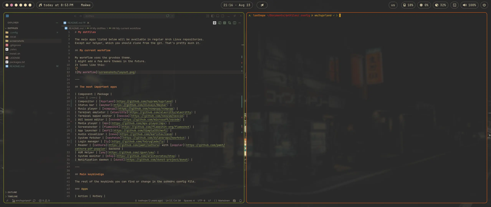

# My dotfiles

The main apps listed below will be available in regular Arch Linux repositories.
Except aur helper, which you should clone from the git. That's pretty much it.

## My current workflow 

My workflow uses the gruvbox theme. 
I might add a few more themes in the future.
It looks like this:

---

## The most important apps

| Component | Package |
| :--- | :---: |
| Compositor | [Hyprland](https://github.com/hyprwm/hyprland) |
| Status bar | [waybar](https://github.com/Alexays/Waybar) |
| Music player | [ncmpcpp](https://github.com/ncmpcpp/ncmpcpp) |
| Terminal emulator | [alacritty](https://github.com/alacritty/alacritty) |
| Terminal based editor | [neovim](https://github.com/neovim/neovim) |
| GUI based editor | [vscode](https://github.com/microsoft/vscode) |
| Media player | [mpv](https://github.com/mpv-player/mpv) |
| Screenshoter | [flameshot](https://github.com/flameshot-org/flameshot) |
| App launcher | [wofi](https://github.com/SimplyCEO/wofi) |
| Audio visualizer | [cava](https://github.com/karlstav/cava) |
| System fetcher | [neofetch](https://github.com/dylanaraps/neofetch) |
| Login manager | [ly](https://github.com/fairyglade/ly) |
| Reader | [zathura](https://github.com/pwmt/zathura) with [poppler](https://github.com/pwmt/zathura-pdf-poppler) backend |
| AUR Helper | [yay](https://github.com/Jguer/yay) |
| System monitor | [btop](https://github.com/aristocratos/btop) |
| Notification daemon | [dunst](https://github.com/dunst-project/dunst) |

---

## Main keybindigs

The rest of the keybinds you can find or change in the sxhkdrc config file.

### Apps

| Action | Hotkey |
| --- | :---: |
| Close the app | ``Super + Q`` |
| Terminate the process | ``Super + Shift + Q`` |
| Terminal | ``Super + K`` |
| Browser | ``Super + B`` | 
| Code editor | ``Super + G`` |
| File manager | ``Super + I`` |
| Volume controller | ``Super + P`` |
| Messanger | ``Super + T`` |
| Music player (Spotify) | ``Super + M`` |
| Reader | ``Super + R`` |
| Notes | ``Super + O`` |

### Miscellaneous

| Action | Hotkey |
| --- | :---: |
| Switch workspaces | ``Super + 1-6`` |
| App launcher | ``Super + Space`` |
| Reload hotkey daemon | ``Super + Esc`` |

### Window rules

| Action | Hotkey |
| --- | :---: |
| Floating/Tiled mode | ``Super + V`` |
| Fullscreen mode | ``Super + F`` |

## Todo

- [x] Migrate to the wayland

