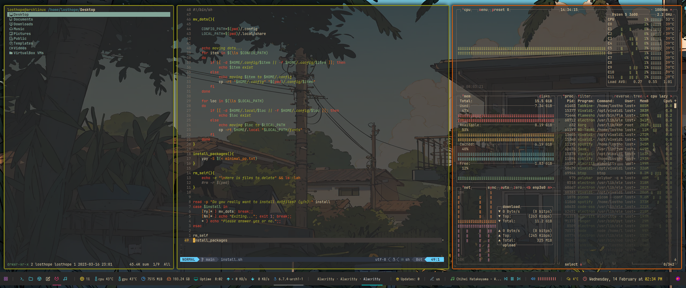

# My dotfiles

The main apps listed below will be available in regular Arch Linux repositories.
Except aur helper, which you should clone from the git. That's pretty much it.

## My current workflow 

My workflow uses the gruvbox theme. 
I might add a few more themes in the future.
It looks like this:

---

## The most important apps

| Component | Package |
| :--- | :---: |
| Compositor | [picom](https://github.com/yshui/picom) |
| Window Manager | [bspwm](https://github.com/baskerville/bspwm) |
| Status bar | [polybar](https://github.com/polybar/polybar) |
| Music player | [ncmpcpp](https://github.com/ncmpcpp/ncmpcpp) |
| Terminal emulator | [alacritty](https://github.com/alacritty/alacritty) |
| Terminal based editor | [neovim](https://github.com/neovim/neovim) |
| GUI based editor | [vscode](https://github.com/microsoft/vscode) |
| Hotkey daemon | [sxhkd](https://github.com/baskerville/sxhkd) |
| Media player | [mpv](https://github.com/mpv-player/mpv) |
| Screenshoter | [flameshot](https://github.com/flameshot-org/flameshot) |
| App launcher | [rofi](https://github.com/davatorium/rofi) |
| Audio visualizer | [cava](https://github.com/karlstav/cava) |
| System fetcher | [neofetch](https://github.com/dylanaraps/neofetch) |
| Login manager | [sddm](https://github.com/sddm/sddm) |
| Reader | [zathura](https://github.com/pwmt/zathura) with [poppler](https://github.com/pwmt/zathura-pdf-poppler) backend |
| AUR Helper | [yay](https://github.com/Jguer/yay) |
| System monitor | [btop](https://github.com/aristocratos/btop) |
| Notification daemon | [dunst](https://github.com/dunst-project/dunst) |

---

## Main keybindigs

The rest of the keybinds you can find or change in the sxhkdrc config file.

### Apps

| Action | Hotkey |
| --- | :---: |
| Close the app | ``Super + Q`` |
| Terminate the process | ``Super + Shift + Q`` |
| Terminal | ``Super + Return`` or ``Alt + K`` |
| Browser | ``Alt + B`` | 
| Code editor | ``Alt + G`` |
| File manager | ``Alt + I`` |
| Volume controller | ``Alt + P`` |
| Messanger | ``Alt + T`` |
| Music player (Spotify) | ``Alt + Q`` |
| Reader | ``Alt + R`` |
| Notes | ``Alt + O`` |

### Miscellaneous

| Action | Hotkey |
| --- | :---: |
| Switch workspaces | ``Super + 1-6`` |
| App launcher | ``Super + Space`` |
| Reload hotkey daemon | ``Super + Esc`` |
| Random wallpaper | ``Super + Alt + W`` |
| Restart window manager | ``Super + Alt + R`` |
| Select theme | ``Alt + Space`` |

### Window rules

| Action | Hotkey |
| --- | :---: |
| Rotate windows | ``Super + R`` |
| Switch windows | ``Super + C`` |
| Split equally | ``Super + Equal`` |
| Switch layout to monocle | ``Super + M`` |
| Swap the biggest window | ``Super + G`` |
| Floating mode | ``Super + S`` |
| Fullscreen mode | ``Super + F`` |
| Tiled mode | ``Super + T`` |
| Preselect the window based on direction | ``Super + Left, Down, Up, Right`` |
| Preelect the window based on ratio | ``Super + Ctrl + 1-9`` |

### Session

| Action | Hotkey |
| --- | :---: |
| Reboot | ``Ctrl + Super + Alt + R `` |
| Poweroff | ``Ctrl + Super + Alt + P `` |
| Sleep | ``Ctrl + Super + Alt + S `` |
| Quit | ``Ctrl + Super + Alt + Q `` |

## Todo

- [ ] Fix the install script
- [ ] Migrate to the wayland
- [ ] Add more themes

